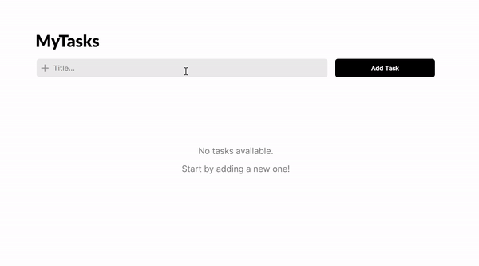

# MyTasks - TODO App

A simple and intuitive task management application built with React.

## Description

With a clean and simple interface, this project includes the following features:

-   Adding new tasks
-   Marking tasks as completed or pending
-   Deleting tasks
-   Viewing detailed task information

## Demo



## Deploy

This project is available at:  
🔗 **[MyTasks - TODO App](https://my-tasks-chi.vercel.app/)**

## Built With


## Installation

### Steps

1. Clone the repository:
    ```bash
    git clone https://github.com/marcellacarneiro/my-tasks.git
    ```

2. Navigate into the project folder:
    ```bash
    cd my-tasks
    ```

3. Install dependencies:
    ```bash
    npm install
    ```

4. Start server:
    ```bash
    npm start
    ```

5. Open your browser and navigate to:
    ```bash
    http://localhost:3000
    ```

## License

This project is licensed under the MIT License. See the LICENSE file for details.

## Contact

[](https://www.linkedin.com/in/marcella-carneiro-b8428b26b/)


